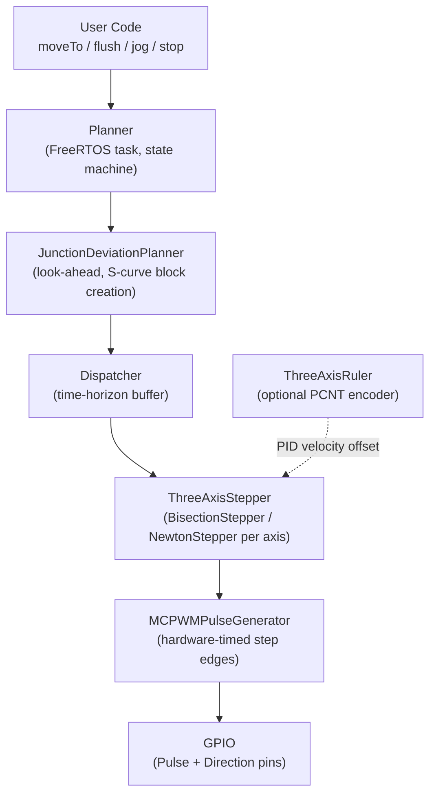

# ThreeAxisStepper

> **ESP32 3-axis stepper controller with S-curve motion, look-ahead planning, optional ruler feedback PID, and exact hardware-timed pulses.**

A production-ready ESP-IDF component for anyone building a motion machine — CNC router, 3D printer, laser cutter, pick-and-place — on an ESP32. Written from scratch after spending nearly a month finding that almost no one pushes the ESP32 to this level of motion control. This is shared freely so that others facing the same challenges have a solid starting point and don't have to suffer the same bugs without reference material.

**Free to use, free to reference, free to modify.**

---

## Who is this for?

This library is aimed at **advanced ESP32/ESP-IDF developers** who are comfortable with:

- ESP-IDF build system and FreeRTOS task management
- Stepper motor driver hardware (step/direction interface)
- Motion control concepts (acceleration, jerk, feedrate)

If you are building your own machine and want a high-quality motion backend rather than porting a full firmware like Grbl or Marlin, this component is a strong starting point or reference.

---

## Key Features

- **7-phase S-curve motion profile** — jerk-limited acceleration and deceleration on every move; no trapezoid shortcuts. Produces dramatically smoother motion and far less mechanical resonance than the trapezoidal profiles used in most open-source firmware.
- **Exact pulse timing — not DDA** — instead of the classic digital differential analyser (DDA) approach where a fixed-rate ISR decides whether to step on each tick, this library analytically solves the exact time of every future pulse directly from the continuous S-curve position function. Each pulse time is computed once and handed to hardware; there is no per-tick decision loop.
- **Hardware-timed pulses via MCPWM** — the ESP32 MCPWM peripheral schedules each step edge independently with no CPU involvement at fire time. Measured pulse timing error is **≈ 2 µs**, giving an interval error of only **≈ 4 µs**. That is exceptional for a microcontroller without a dedicated step-timer ASIC.
- **Low CPU overhead** — under logic analyzer measurement the motion pipeline consumes only **≈ 10–20 % CPU**, leaving plenty of headroom for your application code.
- **Look-ahead junction deviation planner** — Grbl/Marlin-style backward + forward velocity planning passes with centripetal junction-speed model. Smooth cornering across chained segments with no unnecessary deceleration on collinear paths.
- **Graceful stop / resume and emergency stop** — full state machine (`IDLE → NORMAL → FLUSHING → STOPPING → STOPPED`). `stop()` decelerates cleanly; `resume()` continues from the queue. `emergency_stop()` halts immediately and recovers.
- **Jog mode** — call `jog()` repeatedly to keep an axis moving at a set speed; the machine decelerates automatically when you stop calling it (configurable timeout).
- **Callback injection** — insert `std::function`-compatible callbacks between moves; useful for tool changes, spindle on/off, I/O triggers, etc.
- **Optional closed-loop encoder feedback** — `ThreeAxisRuler` reads quadrature encoders via the ESP32 PCNT peripheral. A PID velocity offset in the stepper corrects position error in real time.
- **Modular, extensible design** — swap in your own `PulseGenerator`, numerical solver (`BaseStepper`), or speed planner (`ISpeedPlanner`) without touching the rest of the stack.

---

## Architecture



| Layer | Class(es) | Responsibility |
|---|---|---|
| API | `Planner` | G-code-style `moveTo()` interface, state machine, FreeRTOS task |
| Planning | `JunctionDeviationPlanner` | Look-ahead buffer, junction speeds, S-curve block creation |
| Dispatch | `Dispatcher` | Converts blocks into profiles, maintains a time-horizon of buffered motion |
| Segmentation | `ThreeAxisStepper` | Slices each full S-curve profile into `DeltaTime`-sized sub-segments so the solver produces pulse times incrementally, preventing the pulse queue from being flooded ahead of consumption |
| Solving | `BisectionStepper`, `NewtonStepper` | Computes exact pulse times from each sub-segment profile using a numerical root-finder |
| Pulse HW | `MCPWMPulseGenerator` | Schedules step pulses via ESP32 MCPWM peripheral |
| Feedback | `ThreeAxisRuler`, `opticsRulerDriver` | Quadrature encoder via PCNT, PID velocity offset |

---

## Quick Start

### 1. Add the component

Copy `components/Stepper/` into your project's `components/` directory. It will be picked up automatically by the ESP-IDF build system.

### 2. Minimal motion example

```cpp
#include "Planner.h"

extern "C" void app_main(void)
{
    StepperConfig config = {
        .PulsePin = {GPIO_NUM_14, GPIO_NUM_13, GPIO_NUM_12},  // X, Y, Z step
        .DirPin   = {GPIO_NUM_19, GPIO_NUM_18, GPIO_NUM_21},  // X, Y, Z direction
        .StepUnit = {0.005f, 0.005f, 0.005f}                  // mm per step (0.005 = 200 steps/mm)
    };

    Planner planner;
    planner.init(config);

    // Motion limits
    planner.setMaxAcceleration(100.0f);    // mm/s²
    planner.setMaxJerk(1000.0f);           // mm/s³
    planner.setMaxSpeed(40.0f);            // mm/s
    planner.setJunctionDeviation(0.05f);   // mm

    // Queue moves (absolute coordinates, mm) then flush to execute
    planner.moveTo(Vec3{10,  0,  0}, 20);  // X+10 mm at 20 mm/s
    planner.moveTo(Vec3{10, 10,  0}, 20);  // Y+10 mm
    planner.moveTo(Vec3{ 0, 10,  0}, 20);  // X back to 0
    planner.moveTo(Vec3{ 0,  0,  0}, 20);  // Y back to 0

    planner.flush(true);  // true = block until motion complete
}
```

### 3. Core affinity — important for WiFi users

> **The WiFi stack on ESP32 runs on core 0 and will preempt tasks on the same core, degrading pulse timing.**
>
> Pin your application / networking to core 0 and let the motion stack run exclusively on core 1.
> Two things need to be on core 1:
>
> 1. **Planner task** — controlled by `PLANNER_TASK_PRIO` and `PLANNER_TASK_STACK` in `StepperConfig.h`. Use `xTaskCreatePinnedToCore()` for any of your own tasks that call into `Planner`.
> 2. **`esp_timer` task** — `ThreeAxisStepper` schedules pulse times via `esp_timer`. If the `esp_timer` task runs on core 0, WiFi interrupts can delay pulse callbacks. Pin it to core 1 in `menuconfig`: **Component config → ESP Timer → `CONFIG_ESP_TIMER_TASK_AFFINITY` → Core 1**.

---

## Planner API Reference

| Method | Description |
|---|---|
| `init(config)` | Initialise hardware and start the planner task |
| `moveTo(pos, speed, timeout)` | Queue an absolute move to `pos` (mm) at `speed` (mm/s). Blocks on back-pressure if buffer full |
| `flush(wait, timeout)` | Insert a decelerate-to-stop marker. Pass `true` to block until the machine is idle |
| `addCallback(fn, timeout)` | Inject a callback to fire after the preceding move completes |
| `addWait(time_s, timeout)` | Insert a dwell (pause) of `time_s` seconds at the current position |
| `stop()` | Graceful stop — decelerates the current block, preserves the remaining queue |
| `resume()` | Resume execution of the queue after `stop()` |
| `emergency_stop()` | Immediate halt — clears all buffers, resets stepper. Position is preserved |
| `reset()` | Reset planner state (does not reset position) |
| `waitForIdle()` | Block caller until planner reaches IDLE or STOPPED |
| `isFinish()` | Non-blocking check: returns `true` when planner is idle |
| `setCurrentPos(pos)` | Set logical position without moving (coordinate system shift) |
| `getCurrentPos()` | Returns current `Vec3` position in mm |
| `setJogAxis(axis)` | Select jog axis (`JOG_X_POS`, `JOG_X_NEG`, etc.) |
| `setJogSpeed(speed)` | Set jog speed in mm/s |
| `jog(keepTimeUs)` | Call repeatedly to jog; auto-stops after `keepTimeUs` without a new call |
| `setMaxAcceleration(a)` | Maximum acceleration in mm/s² |
| `setMaxJerk(j)` | Maximum jerk in mm/s³ (controls S-curve smoothness) |
| `setMaxSpeed(s)` | Global speed cap in mm/s |
| `setJunctionDeviation(d)` | Junction deviation radius in mm (higher = faster cornering, less accurate) |

---

## Configuration Reference (`StepperConfig.h`)

| Define | Default | Description |
|---|---|---|
| `PLANNER_BLOCK_BUFFER_SIZE` | `100` | Maximum number of planned blocks in the look-ahead buffer |
| `PLANNER_TASK_STACK` | `4096` | Planner FreeRTOS task stack size (bytes) |
| `PLANNER_TASK_PRIO` | `2` | Planner task priority |
| `DeltaTime` | `0.001f` | Profile trim interval (s). Smaller is good for PID. Larger need to be careful for PULSE_QUEUE_LENGTH |
| `MotionQueueSize` | `8` | Depth of the low-level motion profile queue per axis |
| `CallbackQueueSize` | `8` | Maximum callbacks queued at one time |
| `MIN_SEGMENT_TIME` | `0.005f` | Segments shorter than this (s) are merged to reduce overhead |
| `JOG_SEGMENT_TIME` | `0.05f` | Duration of each jog cruise segment (s) |
| `StepPulseWidth` | `20` | Step pulse high width (µs) |
| `StepLostLimit` | `2` | Steps of mismatch allowed before a `STEP_LOST_ERROR` callback fires |
| `NewtonStepperAvailable` | `false` | Experimental. Set to `true` to enable the Newton solver (faster but unstable and requires C¹ profiles) |

### `StepperConfig` struct fields

```cpp
struct StepperConfig {
    gpio_num_t PulsePin[3];                          // Step output pins for X, Y, Z
    gpio_num_t DirPin[3];                            // Direction output pins for X, Y, Z
    bool       DirInverse[3];                        // Invert direction signal per axis
    float      StepUnit[3];                          // mm per step per axis
    gpio_num_t EnablePin;                            // Motor enable pin (GPIO_NUM_NC to skip)
    FixedFunction<void(bool)> enablePinCallback;     // Optional: custom enable/disable handler
    FixedFunction<Vec3()>     rulerCallback;         // Optional: encoder position read
    FixedFunction<void(const Vec3&)> rulerSetPositionCallback; // Optional: encoder position set
    FixedFunction<void(ErrorType)>   errorCallback;  // Optional: step-lost / PID error handler
};
```

---

## Pin Wiring Example

Based on the test fixture in `main/main.cpp`:

| Signal | GPIO |
|---|---|
| X Step | 14 |
| X Direction | 19 |
| Y Step | 13 |
| Y Direction | 18 |
| Z Step | 12 |
| Z Direction | 21 |
| Logic Analyser Marker | 27 |

---

## How It Works

### S-Curve Motion (7 phases)

Every `moveTo()` call produces an `SCurveSegmentProfile` — never a raw trapezoid. The profile has seven phases:

```
speed
  ^
  |      ___________
  |     /           \
  |    /             \
  |___/               \___
  |
  +--jerk_up--const_accel--jerk_down--cruise--jerk_down--const_decel--jerk_up--> time
```

Jerk is bounded by `maxJerk` (mm/s³). This means acceleration itself ramps smoothly, eliminating the velocity discontinuity that causes mechanical shock in trapezoidal profiles. The result is quieter motors, less frame vibration, and fewer missed steps at high speed.

The profile supports asymmetric entry and exit speeds, which the junction deviation planner exploits to keep the machine moving through corners without unnecessary deceleration.

### Pulse Timing (MCPWM + Numerical Solver)

Rather than the classic DDA (digital differential analyser) approach — where a timer ISR fires at a fixed rate and decides whether to step — this library computes the **exact time** of each future pulse from the continuous S-curve position function.

The `BisectionStepper` (default) inverts the position integral $x(t) = \int v(t)\,dt$ using a bisection root-finder to determine the precise moment when the accumulated position crosses the next step boundary. The result is passed directly to the MCPWM peripheral, which fires the pulse edge in hardware without any ISR jitter.

$$t_{\text{next pulse}} : \quad x(t_{\text{next}}) = n \cdot \text{StepUnit}$$

This is why the timing error is only ≈ 2 µs — the bottleneck is the MCPWM hardware resolution, not an ISR latency budget.

The optional `NewtonStepper` uses Newton–Raphson iteration instead of bisection. It converges faster (typically 2–3 iterations vs. up to 20) but requires the speed profile to be C¹ continuous. It serves as a modular example of how to extend `BaseStepper`. Enable it with `#define NewtonStepperAvailable true`.

### Look-Ahead Planning (Junction Deviation)

The `JunctionDeviationPlanner` maintains a ring buffer of up to `PLANNER_BLOCK_BUFFER_SIZE` planned segments. When a new segment is added:

1. **Junction speed** is computed using the centripetal acceleration model (same as Grbl/Marlin). The tighter the corner angle, the lower the allowed junction speed.
2. A **backward pass** propagates maximum achievable exit speeds from the last known stop point toward the front of the buffer.
3. A **forward pass** propagates from the current entry speed and caps each block's entry against what the axis can actually reach given distance and acceleration.

This ensures the machine runs at the highest safe speed through every segment while guaranteeing it can always decelerate to the required exit speed.

---

## Extending the Library

The design is intentionally modular. Common extension points:

### Custom pulse generator
Subclass `PulseGenerator` and implement `addPulse()`, `reset()`, `isRunning()`, `getCount()`, `setCount()`. Pass an instance via `StepperConfig` or swap it in `BaseStepper::init()`.

### Custom solver
Subclass `BaseStepper` and implement `sendPulse()`, `resetTimer()`, `getPosition()`, `setPosition()`. Use `NewtonStepper` as a reference for a fast approach or `BisectionStepper` for maximum robustness.

### Custom speed planner
Implement the `ISpeedPlanner` interface to replace `JunctionDeviationPlanner` entirely — useful if you want a different planning model (e.g., time-optimal, constant-jerk 3rd-order, or a simpler single-segment planner for lighter use cases).

### More axes
MCPWM supports up to **6 channels** on the ESP32. Extending from 3 to 6 axes means expanding the axis arrays in `StepperConfig`, `ThreeAxisStepper`, and `MCPWMPulseGenerator` accordingly.

---

## Test Suite

`main/main.cpp` contains a comprehensive test suite that runs on the hardware and can be used as a soak test (it loops indefinitely after the first pass).

| # | Test | What it verifies |
|---|---|---|
| 1 | Single-axis move | X-only move, position assertion |
| 2 | Diagonal XY | 45° two-axis coordinated move |
| 3 | 3-axis XYZ | Full three-axis diagonal |
| 4 | Chained segments (square path) | 90° junction planning, 4-segment loop |
| 5 | 50 collinear micro-segments | Look-ahead stress, buffer handling |
| 6 | Zig-zag path | Rapid direction reversals, junction deviation |
| 7 | Callbacks between moves | Callback injection and ordering |
| 8 | Negative direction | Reverse on all three axes |
| 9 | Speed changes | Mixed slow/fast segments in sequence |
| 10 | `setCurrentPos` | Coordinate system reset while idle |
| 11 | Stop & Resume | Mid-travel deceleration, queue preserved, resumption |
| 12 | Emergency stop | Immediate halt, position preserved, recoverable |
| 13 | Reset | Buffer cleared, clean move after reset |
| 14 | Buffer back-pressure (120 segments) | Queue saturation, back-pressure blocking |
| 15 | Tiny moves (0.01 mm) | Sub-step accumulation and resolution |
| 16 | Circle approximation (72 segments) | Arc via short chained segments |
| 17 | Long single move (300 mm) | Sustained cruise at max speed |
| 18 | Multiple flush calls | Batch-then-flush pattern |
| 19 | Mixed axes + callbacks | Combined multi-axis and callback sequencing |
| 20 | Parameter changes | Runtime acceleration / jerk updates |
| 21 | Callback timing | Callback fires at correct position |
| 22 | Jog | Continuous jog with auto-timeout |
| 23 | Jog stop | Controlled deceleration from jog mode |

---

## Requirements

- **ESP-IDF** v5.x (uses MCPWM v2 API and PCNT driver)
- **Target**: ESP32 (tested). MCPWM peripheral is required.
- C++17 (`if constexpr`, placement new)

---

## License

This project is released freely — **use it, reference it, modify it** as you wish. Attribution is appreciated but not required.

---

*Built with the belief that the ESP32 is capable of far more sophisticated motion control than most people attempt. Hopefully this saves someone a month of debugging.*
